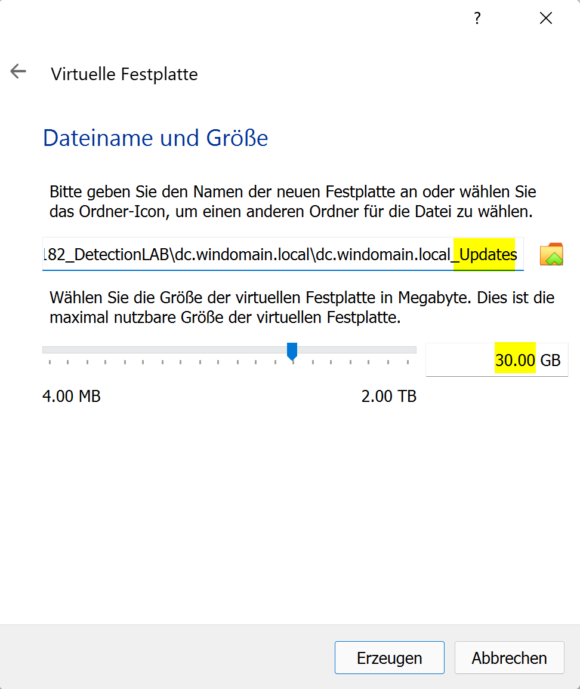
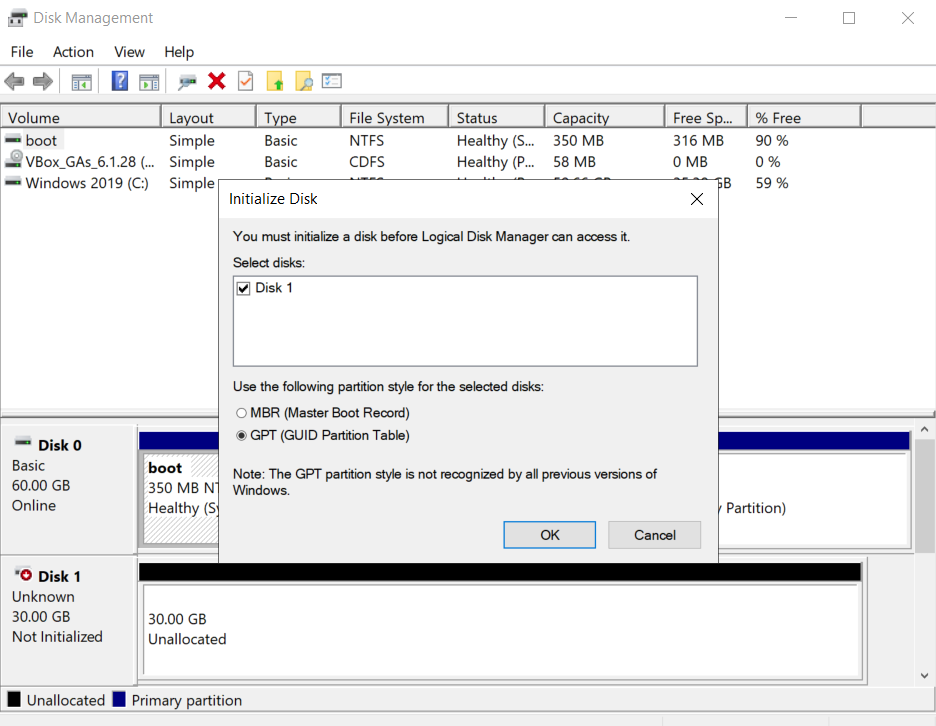
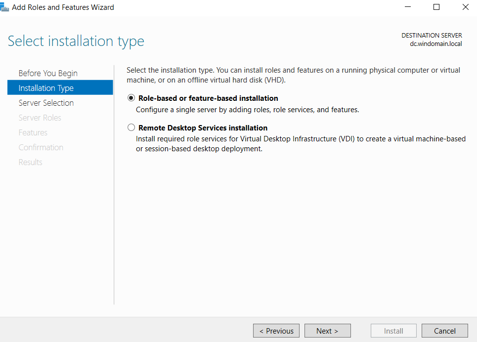
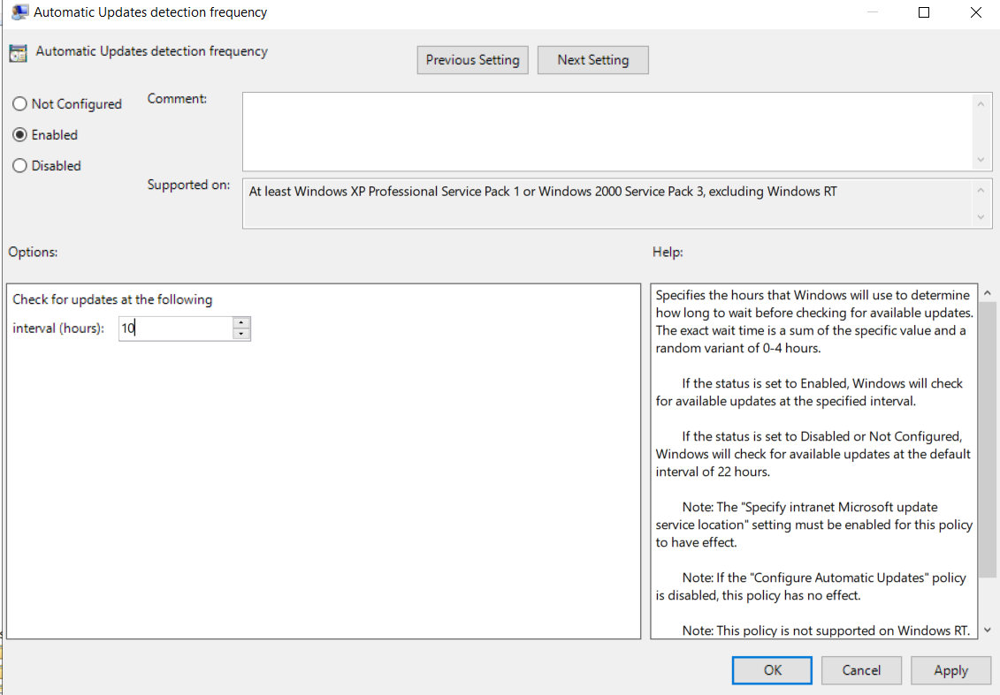
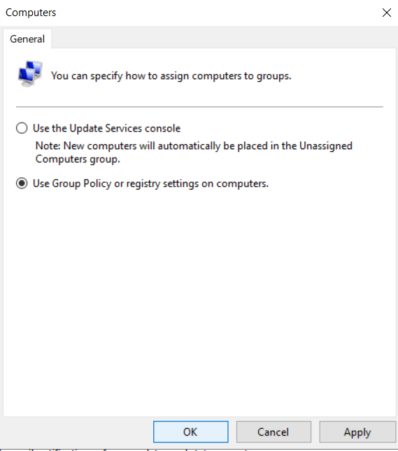
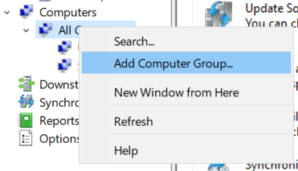

# Installation Server

## Update Laufwerk vorbereiten

Da wir in diesem Fall die Updates auf einem zweiten Laufwerk speichern wollen, müssen wir dieses erstmal in VBox hinzufügen.

1. VM auwählen und oben auf "Ändern" klicken

2. In den Einstellungen auf "Massenspeicher" wechseln

3. Im aufkommenden Fenster oben "Erstellen" auswählen

4. Nun muss man den Dateityp der virtuellen Festplatte auswählen. Ich wähle hier **VMDK**

5. Danach bei "Art der Speicherung", **dynamisch alloziert** auswählen

6. Nun Festplattengrösse auf **30GB** stellen und den **Dateinamen** anpassen und den Server wieder starten

7. Datenträgerverwaltung öffnen. Es sollte automatisch ein zweites Fenster erscheinen. Dort **GPT** auswählen und auf **OK** klicken

8. Rechtsklick auf den freien Speicher der neuen Festplatte und dann **"Neues einfaches Volumen"** auswählen

9. Hier auf weiter klicken bis zum Punkt "Partition formatieren". Dort den Namen der Festplatte auf "Updates" ändern und dann "Weiter" klicken

10. Die zweite Festplatte ist hinzugefügt und wird im Explorer angezeigt

## WSUS Feature hizufügen

1. Server Manager auf dem DC starten

2. Oben rechts in der Navbar auf "Verwalten" klicken

3. Im aufkommenden Menu auf "Rollen und Features hinzufügen klicken

4. Es öffnet sich ein neues Fenster. Erst auf **weiter** klicken. Dann bei Installationstyp dort "Rollenbasierte oder Featurebasierte installation auswählen"

5. Bei der Serverauswahl den DC Server auswählen

6. Aus der Liste der Rollen, die Rolle "Windows Server Update Services (WSUS)" auswählen

7. Im aufkommenden Fenster auf "Features hinzufügen" klicken

8. Danach können wir einfach auf "weiter" klicken bis man zum Punkt **WSUS > Inhalt** kommt. Dort muss man den Pfad angeben, an dem man die Updates speichern möchte angeben. In meinem Fall ist das "E:\"

9. Zuletzt auf "Installieren" klicken

## Konfiguration

1. Wenn man nun die Software (Windows Server Update Services) startet, öffnet sich ein Konfigurationsassistent. Hier erstmal bis zum Punkt **"Upstreamserver auswählen"** weiterklicken. Da wir keinen weiteren Upstreamsever haben der Updates zur Verfügung stellt, wählen wir hier **Microsoft Update** aus

2. Nun kann ein **Proxy Server** angegeben werden. Wir haben allerdings keinen und können deshalb weiter zum nächsten Punkt

3. WSUS **Synchronisiert** mit den vorherigen Updates nun zum ersten mal. Einfach warten bis es fertig ist

4. Jetzt kann man auswählen in welcher **Sprache** die Updates installiert werden sollen. Wir wählen hier Deutsch und Englisch

5. Nun kann man angeben für welche **Produkte** Updates heruntergeladen werden. Wir wählen hier, der einfachheit wegen, alle aus

6. Als nächstes wählen wir aus welche **Art von Updates** heruntergeladen werden sollen. Ich wähle hier folgende: **Definitionsupdates, Service Packs, Sicherheitsupdates, Updates, Wichtige Updates**

7. Nun können wir einen Synchronisierungsplan festlegen. Ich will das der Server 1x am Tag um 01:00 Uhr Synchronisiert

8. Zuletzt starten wir die Erstsynchroniesierung

9. Zuletzt auf **Fertigstellen** klicken

10. Als nächstes müssen wir die Group Policies einrichten. Dafür das Verwaltungstool **"Group Policy Management"** öffnen und rechtsklick auf die OU **Windomain.local > Servers**. Im Kontextmenu **"Create GPO.. and link here"** auswählen

11. Als Name geben wir **WSUS Server** an. Rechtsklick auf die neu erstellte Policy und im Menu **Edit** auswählen

12. Es öffnet sich der **Policy Editor**. Darin öffnen wir **Computerconfiguration > Richtlinien > Administrative Vorlagen > Windows-Komponenten > Windows Update**. Zuerst die Richtlinie **Configure automatic updates** bearbeiten

13. Oben links auf **Enabled** stellen. Unten links im Dropdown menu **3 - ...notify for install** auswählen und weitere Einstellungen wie im Bild belassen:

14. Als nächstes die Richtlinie **Specify intranet MS Update service location** bearbeiten. Aktivieren und als internen Pfad **http:dc.windomain.local:8530** wie im Bild angeben:

15. Nun die Richtlinie **Automatic Updates detection frequecy** bearbeiten. Aktivieren und Interval auf alle **10 Stunden** setzen

16. Und die Richtlinie **Enable client-side targeting** aktivieren. Als Target Groupname **Server** eingeben

17. Die Group Policy nun noch mit den Domaincontrollern verknüpfen indem wir im **"Group Policy Management"** rechtsklick auf die OU und im Menu **Link an existing GPO** auswählen

18. Im neuen Fenster die zuvor erstellte GPO **WSUS Server** auswählen und **OK** klicken

19. Nun wieder die WSUS Applikation öffnen. Für die Clientseitige zuordnung müssen wir unter **Options > Computers** noch den Punkt **Use Group Policy or registry settings on computers** auswählen.

20. Ich lege noch Gruppen für die Geräte an um Server und Clients zu unterscheiden. Dafür Rechtsklich links auf **Computers > All Computers** und im Menü **"Add Computer Group"** auswählen. Auf diese Weise die Gruppe **Server** und die Gruppe **Clients** erstellen

21. Als nächstes müssen wir die Richtlinien auf dem Windows 11 Client erneuern. Dafür auf dem Client **CMD** öffnen und den Befehl **gpupdate /force** ausführen

22. Nun zurück zum Server. Um die Geräte zu den upzudatenden Computern hinzuzufügen, Rechtsklick auf die zuvor erstellte Computergruppe **Clients** mache und **Search** auswählen. Nun den Win11 Client auswählen. Danach das gleiche für den DC selbst machen, allerdings auf der Gruppe **Server**

23. Der WSUS ist nun fertig konfiguriert und die Geräte hinzgefügt.
