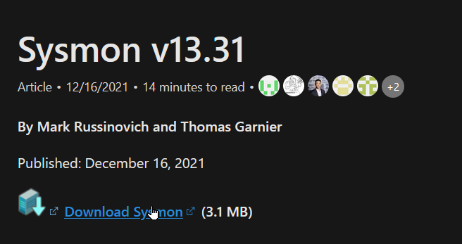
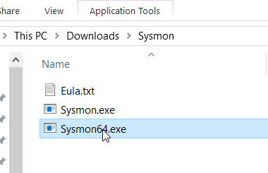
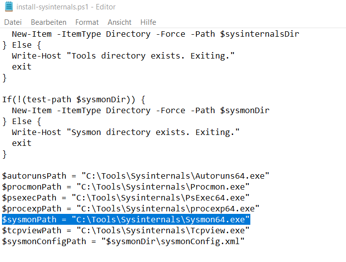

# Installation Sysmon

## Manuell

1. Sysmon kann in den [Microsoft Docs](https://docs.microsoft.com/en-us/sysinternals/downloads/sysmon) als EXE Datei heruntergeladen werden

2. Nun kann man die Exe einfach ausführen und den Assistenten mit den Standardeinstellungen durchklicken

3. Um zu checken ob es installiert ist, kann man im Verwaltungstool "Dienste" den Dienst **Sysmon64** suchen. Falls er vorhanden ist, ist es richtig installiert

## Automatisiert

Da unsere VMs mit Vagrant erstellt werden, kann man die Installation von Sysmon auch Vagrant überlassen. Dafür ist im PS-Script **"install-sysinternals.ps1"** die benötigte Exe Datei zur installation angegeben. Das Script wird vom Vagrantfile aus beim Erstellen der VM aufgerufen.

