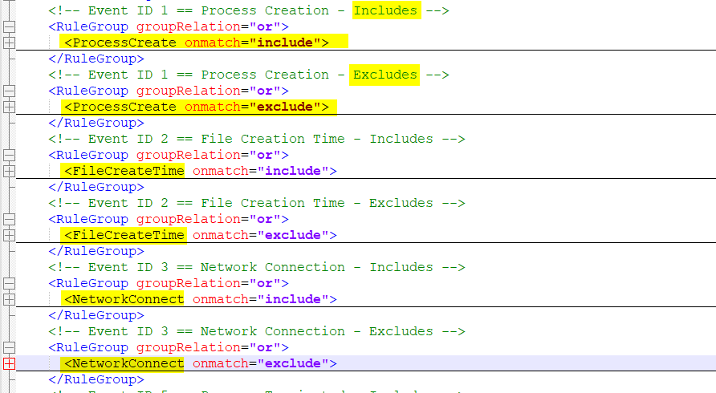

# Konfiguration Sysmon

## Config-File
Sysmon hat eine Zentrale XML-Konfigurationsdatei. Mit folgendem Befehl könnt ihr euch die gesammte Sysmonkonfiguration ausgeben lassen:

```bash
Sysmon64.exe -c
```


Da die Datei über 2000 Zeillen hat, werde ich sie hier nicht einfügen. Sie kann unter dem Pfad **"C:\ProgramData\Sysmon\sysmonConfig.xml"** geöffnet und angeschaut werden.

Die Datei enthält hauptsächlich RuleGroups für die Filterung von Events. Ansonsten enthält sie nur wenige Parameter. Dies kann man sehr gut betrachten wenn man die Datei in einem guten Editor "Collapsed":


Wenn wir es genauer anschauen, sehen wir das jede RuleGroup eine Bestimmte Art von Events abfängt. Für jede Art von Event scheint es 2 Regelgruppen zu geben, einmal include und einmal exclude:


Innerhalb der RegelGruppen werden nun alle nötigen Prozesse angegeben. Wenn man genauere Erbgebnisse möchte, kann man scheinbar auch einzelne Befehle der Prozesse angeben:

