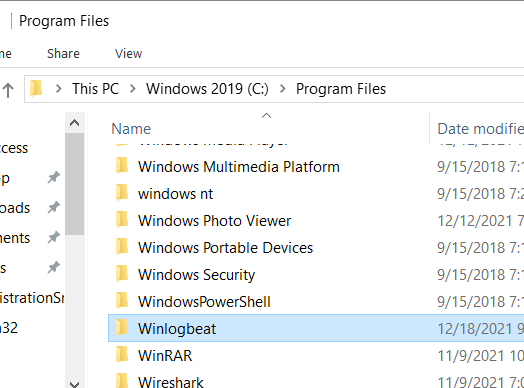
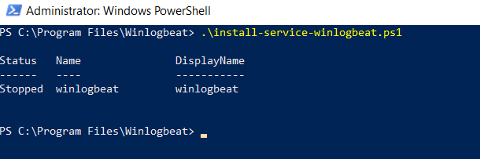
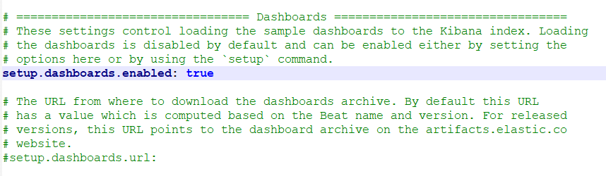
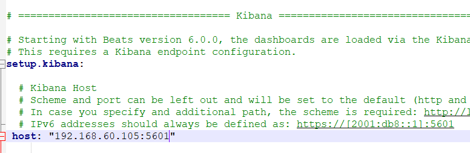
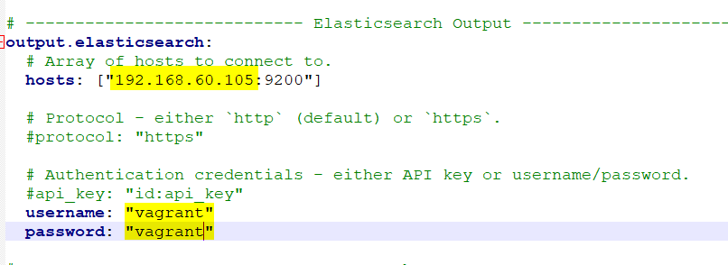
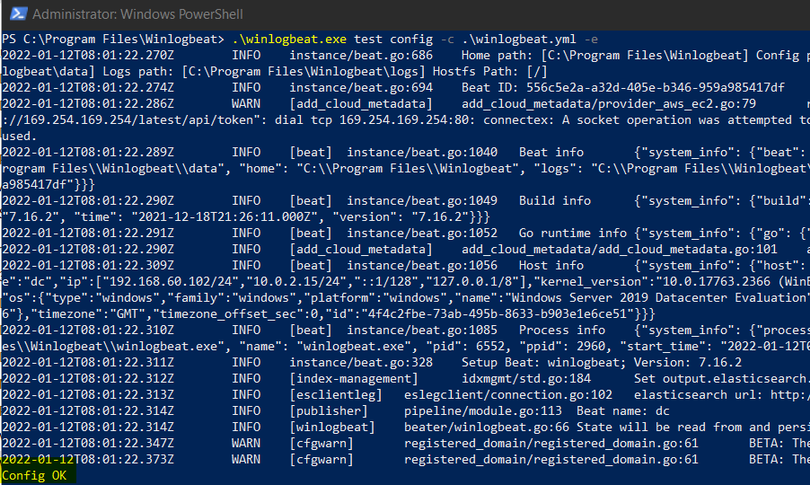
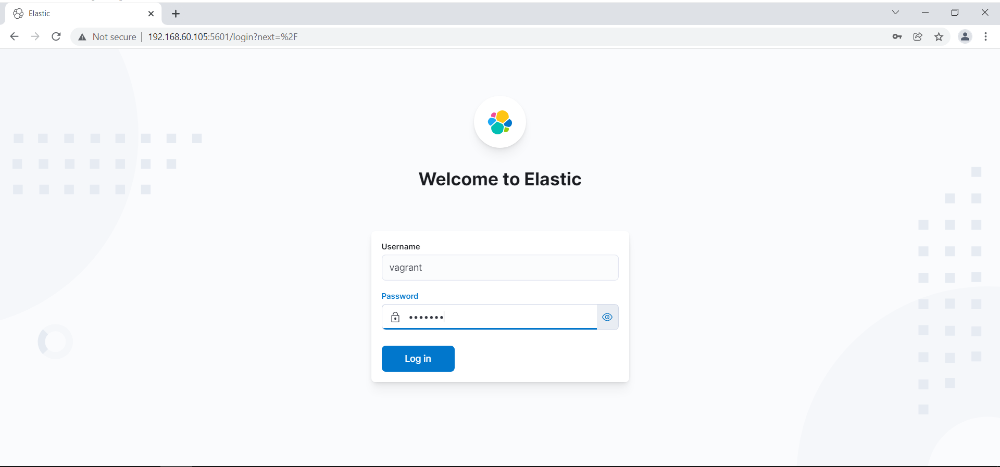

# Installation Winlogbeat

1. Winlogbeat kann [HIER](https://www.elastic.co/de/downloads/beats/winlogbeat) heruntergeladen werden

2. Die Heruntergeladen Zip Datei in den Ordner **"C:\Program Files\"** entpacken und den Entpackten Ordner umbenennen zu **Winlogbeat**


3. Powershell als Administrator öffnen und in den Pfad **"C:\Program Files\Winlogbeat"** wechseln
```Powershell
cd C:\Program Files\Winlogbeat
```

4. Nun das Installationsscript mit folgendem Befehl starten:
```Powershell
.\install-service-winlogbeat.ps1
```

5. Folgendermassen sollte es zum Schluss aussehen:


## Konfiguration

1. Die Datei **"C:\Program Files\Winlogbeat\winlogbeat.yml"** öffnen

2. Im Abschnitt **"Dashboards"** die Option **setup.dashboards.enabled** aktivieren und auf **true** stellen


3. Im Abschnitt **"Kibana"** die Host-IP aktivieren und auf **192.168.60.105:5601** umstellen


4. Im Abschnitt **"Elasticsearch Output"** die Host-IP umstellen auf **192.168.60.105:9200**. Der Benutzernamen und das Passwort müssen noch aktiviert werden und auf "vagrant" gestellt werden


5. Im Abschnitt **"Winlogbeat specific options"** könnte man noch einstellen welche Logs und woher man diese holen möchte. Wir nutzen hier aber einfach die Standardkofniguration.

6. Zum Schluss testen wir die Konfiguration mit folgendem Befehl:
```Powershell
.\winlogbeat.exe test config -c .\winlogbeat.yml -e
```


## Starten

1. Folgenden Befehl in PowerShell ausführen:

```Powershell
Start-Service winlogbeat
```

2. Sobald die Linux-Logger-VM gestartet ist, kann man nun über 192.168.60.105:5601 auf die GUI zugreifen



