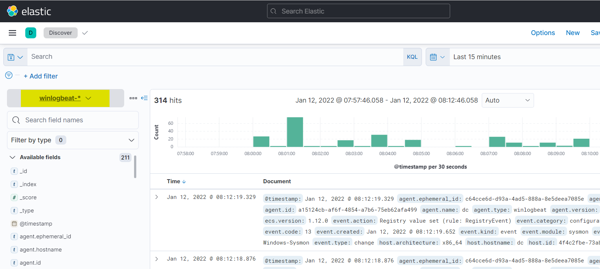
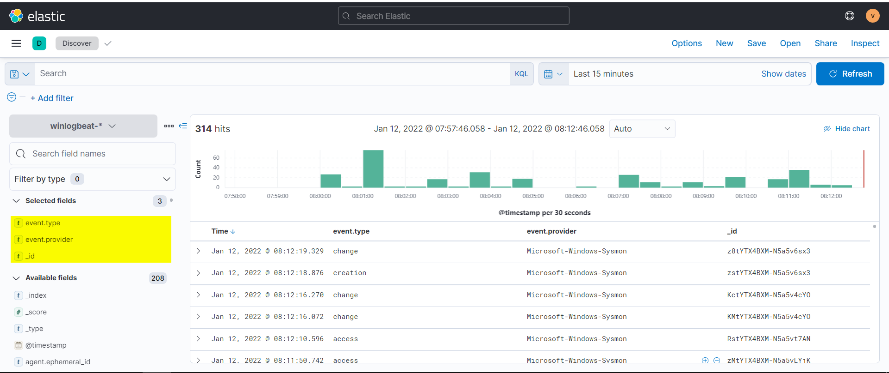

# Testing

Auf der GUI kann man sich nun mit dem Benutzernamen und Passwort **vagrant** anmelden. Damit man Daten sieht muss man allerdings erstmal Links im Dropdownmenu die Indexpattern **"Winlogbeat-*"** auswählen.

Links darunter kann man Filter einstellen um genauer zu spezifizieren welche Daten man möchte. Ich habe zum Beispiel den Filter so angepasst, dass es er mir von jedem Event nur den Typ, den Provider und die ID anzeigt:

