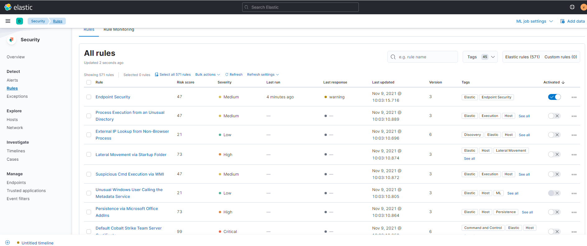
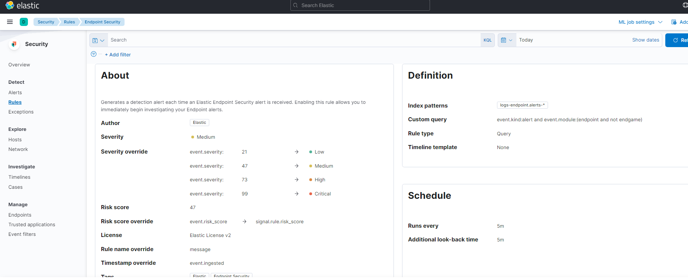

# Rules auf ELK Security Dashboards

In ELK Security hat jede Regel die folgenden Attribute:
* Name
* Risk Score - Erhöhung des Host-Risk Scores bei eintreffen
* Severity - Wie gravierend das Problem ist
* Last Run - Wan zuletzt überprüft
* Last Response - Was bei letzter Prüfung zurückkam
* Last Updated - Wann die Regel zuletzt geändert wurde
* Version
* Tags - Kategorien
* Activated - Ob die regel aktiv ist oder nicht

Jede Regel hat ausserdem eine Definition. Dies ist sozusagen die eigentliche Regel dahinter. Darin wird definiert, welche **Index Pattern** verwendet wird, welchen **Typ** die Regel zugehört, ein **Temlplate** für die Timeline und am wichtigsten, die **Query** welche verwendet wird um die Daten zu filtern.

Dann wird noch definiert wie häufig bzw. wann die Regel überprüft werden soll

