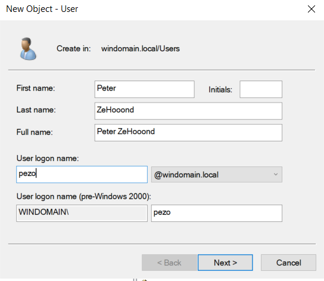
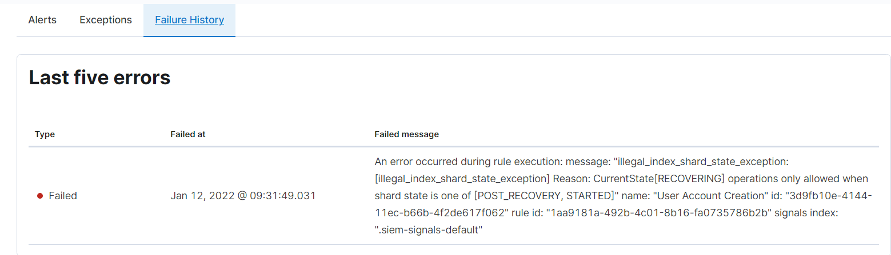

# Testen der Security Dashboards

Für den Test habe ich mir die Regel **User Account Creation** ausgesucht, da ich dies einfach reproduzieren kann.

## About

Diese Regel erkennt versuche einen Benutzer zu erstellen. Wenn z.B ein Hacker sich einen neuen Account erstellen möchte würde es ausschlagen. Natürlich aber auch wenn ein Admin einen neuen Account erstellen möchte.

Der RiskScore ist relativ niedrig und die Severity auf **LoW** gestellt. Wenn die Regel ausschlägt ist es wahrscheinlich immer ein Administrator.

## Definition

### Index patterns
Es verwendet die Patterns **winlogbeat-\*, logs-endpoint.events.\* und logs-windows.\***

### Query
Es überprüft, ob der Prozess um User zu erstellen aktiviert wurde

```sql
process where event.type in ("start", "process_started") and
  process.name : ("net.exe", "net1.exe") and
  not process.parent.name : "net.exe" and
  (process.args : "user" and process.args : ("/ad", "/add"))
```

### Rule type

Event Correlation -> Heisst, wenn ein Event mit der Query übereinstimmt

## Alarm generieren

1. Zuerstmal aktiviere ich die Regel im Security Dashboard

2. Auf dem Windows DC öffne ich dann die AD

3. In der OU **Users** erstelle ich daraufhin einen Benutzer mit folgenden angaben und dem Passwort **Intel123!**:


4. Nachdem erstellen eines Users habe ich in der Regel unter "Alerts" nachgeschaut. Keine Einträge vorhanden. Allerdings einer unter **Failure History**


5. Habe es noch ein paar mal versucht, nie wurde ein Alarm ausgelöst