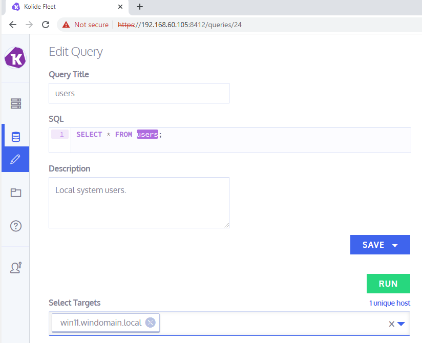
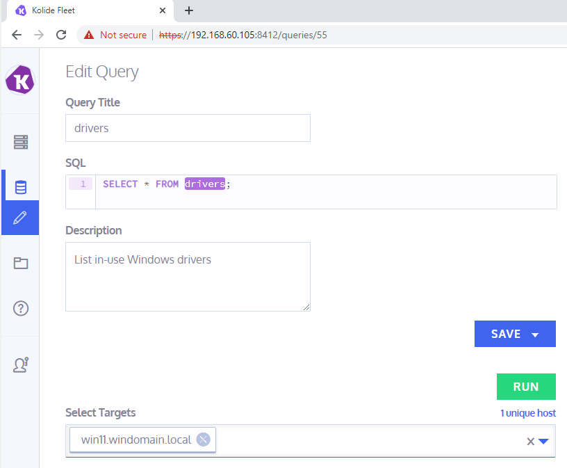

# Testing OSQuery Fleet

Um auf die GUI zuzugreifen **192.168.60.105:8412** als URL angeben.

Um eine Query aufzurufen muss man diese unter "Queries" auswählen und oben rechts aus **Edit/Run Query** klicken

## Test 1
Als ersten Test habe ich alle Benutzer der Windows 11 VM ausgelesen

### Resultate
Das resultat habe ich der Darstellung wegen, exportiert und die CSV zu einer Markdown Tabelle konvertiert:

|host_hostname        |description   |directory |gid                                                   |gid_signed                                                                                    |shell                                                 |type                                                                                                       |uid                  |uid_signed                                                                                                             |username                            |uuid              |
|---------------------|--------------|----------|------------------------------------------------------|----------------------------------------------------------------------------------------------|------------------------------------------------------|-----------------------------------------------------------------------------------------------------------|---------------------|-----------------------------------------------------------------------------------------------------------------------|------------------------------------|------------------|
|win11.windomain.local|Built-in account for administering the computer/domain|          |544                                                   |544                                                                                           |C:\\Windows\\system32\\cmd.exe                        |local                                                                                                      |500                  |500                                                                                                                    |Administrator                       |S-1-5-21-506269580-3574808157-3679676259-500|
|win11.windomain.local|A user account managed by the system.|          |581                                                   |581                                                                                           |C:\\Windows\\system32\\cmd.exe                        |local                                                                                                      |503                  |503                                                                                                                    |DefaultAccount                      |S-1-5-21-506269580-3574808157-3679676259-503|
|win11.windomain.local|Built-in account for guest access to the computer/domain|          |546                                                   |546                                                                                           |C:\\Windows\\system32\\cmd.exe                        |local                                                                                                      |501                  |501                                                                                                                    |Guest                               |S-1-5-21-506269580-3574808157-3679676259-501|
|win11.windomain.local|Vagrant User  |C:\\Users\\vagrant|544                                                   |544                                                                                           |C:\\Windows\\system32\\cmd.exe                        |local                                                                                                      |1000                 |1000                                                                                                                   |vagrant                             |S-1-5-21-506269580-3574808157-3679676259-1000|
|win11.windomain.local|A user account managed and used by the system for Windows Defender Application Guard scenarios.|          |513                                                   |513                                                                                           |C:\\Windows\\system32\\cmd.exe                        |local                                                                                                      |504                  |504                                                                                                                    |WDAGUtilityAccount                  |S-1-5-21-506269580-3574808157-3679676259-504|
|win11.windomain.local|              |%systemroot%\\system32\\config\\systemprofile|18                                                    |18                                                                                            |C:\\Windows\\system32\\cmd.exe                        |special                                                                                                    |18                   |18                                                                                                                     |SYSTEM                              |S-1-5-18          |
|win11.windomain.local|              |%systemroot%\\ServiceProfiles\\LocalService|19                                                    |19                                                                                            |C:\\Windows\\system32\\cmd.exe                        |special                                                                                                    |19                   |19                                                                                                                     |LOCAL SERVICE                       |S-1-5-19          |
|win11.windomain.local|              |%systemroot%\\ServiceProfiles\\NetworkService|20                                                    |20                                                                                            |C:\\Windows\\system32\\cmd.exe                        |special                                                                                                    |20                   |20                                                                                                                     |NETWORK SERVICE                     |S-1-5-20          |

## Test 2
Im zweiten Test habe ich alle Driver der Windows 11 VM ausgelesen

### Resultate
Auch hier habe ich die Resultate exportiert und konvertiert:

|host_hostname        |class         |date      |description                                           |device_id                                                                                     |device_name                                           |driver_key                                                                                                 |image                |inf                                                                                                                    |manufacturer                        |provider          |service           |service_key                                                                |signed|version                                   |
|---------------------|--------------|----------|------------------------------------------------------|----------------------------------------------------------------------------------------------|------------------------------------------------------|-----------------------------------------------------------------------------------------------------------|---------------------|-----------------------------------------------------------------------------------------------------------------------|------------------------------------|------------------|------------------|---------------------------------------------------------------------------|------|------------------------------------------|
|win11.windomain.local|PRINTQUEUE    |1150848000|Local Print Queue                                     |SWD\\PRINTENUM\\{D1BB718E-968D-431A-9EF2-8D8EEDCEF593}                                        |Local Print Queue                                     |HKEY_LOCAL_MACHINE\\SYSTEM\\CurrentControlSet\\Control\\Class\\{1ed2bbf9-11f0-4084-b21f-ad83a8e6dcdc}\\0001|                     |C:\\Windows\\System32\\DriverStore\\FileRepository\\printqueue.inf_amd64_c5faa879d518215d\\printqueue.inf              |Microsoft                           |Microsoft         |                  |                                                                           |1     |10.0.22000.1                              |
|win11.windomain.local|PRINTQUEUE    |1150848000|Local Print Queue                                     |SWD\\PRINTENUM\\{85BED5CF-D162-4664-8BE8-414B97F901DB}                                        |Local Print Queue                                     |HKEY_LOCAL_MACHINE\\SYSTEM\\CurrentControlSet\\Control\\Class\\{1ed2bbf9-11f0-4084-b21f-ad83a8e6dcdc}\\0002|                     |C:\\Windows\\System32\\DriverStore\\FileRepository\\printqueue.inf_amd64_c5faa879d518215d\\printqueue.inf              |Microsoft                           |Microsoft         |                  |                                                                           |1     |10.0.22000.1                              |
|win11.windomain.local|PRINTQUEUE    |1150848000|Local Print Queue                                     |SWD\\PRINTENUM\\{3DA51B45-64D0-449E-8DBC-82700387160E}                                        |Local Print Queue                                     |HKEY_LOCAL_MACHINE\\SYSTEM\\CurrentControlSet\\Control\\Class\\{1ed2bbf9-11f0-4084-b21f-ad83a8e6dcdc}\\0003|                     |C:\\Windows\\System32\\DriverStore\\FileRepository\\printqueue.inf_amd64_c5faa879d518215d\\printqueue.inf              |Microsoft                           |Microsoft         |                  |                                                                           |1     |10.0.22000.1                              |
|win11.windomain.local|PRINTQUEUE    |1150848000|Local Print Queue                                     |SWD\\PRINTENUM\\PRINTQUEUES                                                                   |Local Print Queue                                     |HKEY_LOCAL_MACHINE\\SYSTEM\\CurrentControlSet\\Control\\Class\\{1ed2bbf9-11f0-4084-b21f-ad83a8e6dcdc}\\0000|                     |C:\\Windows\\System32\\DriverStore\\FileRepository\\printqueue.inf_amd64_c5faa879d518215d\\printqueue.inf              |Microsoft                           |Microsoft         |                  |                                                                           |1     |10.0.22000.1                              |
|win11.windomain.local|SOFTWAREDEVICE|1150848000|Generic software device                               |SWD\\MMDEVAPI\\MICROSOFTGSWAVETABLESYNTH                                                      |Generic software device                               |HKEY_LOCAL_MACHINE\\SYSTEM\\CurrentControlSet\\Control\\Class\\{62f9c741-b25a-46ce-b54c-9bccce08b6f2}\\0000|                     |C:\\Windows\\System32\\DriverStore\\FileRepository\\c_swdevice.inf_amd64_655de2ccc6addd01\\c_swdevice.inf              |Microsoft                           |Microsoft         |                  |                                                                           |1     |10.0.22000.1                              |
|win11.windomain.local|SOFTWAREDEVICE|1150848000|Generic software device                               |SWD\\RADIO\\{3DB5895D-CC28-44B3-AD3D-6F01A782B8D2}                                            |Generic software device                               |HKEY_LOCAL_MACHINE\\SYSTEM\\CurrentControlSet\\Control\\Class\\{62f9c741-b25a-46ce-b54c-9bccce08b6f2}\\0001|                     |C:\\Windows\\System32\\DriverStore\\FileRepository\\c_swdevice.inf_amd64_655de2ccc6addd01\\c_swdevice.inf              |Microsoft                           |Microsoft         |                  |                                                                           |1     |10.0.22000.1                              |
|win11.windomain.local|SYSTEM        |1150848000|Remote Desktop Device Redirector Bus                  |ROOT\\RDPBUS\\0000                                                                            |Remote Desktop Device Redirector Bus                  |HKEY_LOCAL_MACHINE\\SYSTEM\\CurrentControlSet\\Control\\Class\\{4d36e97d-e325-11ce-bfc1-08002be10318}\\0005|C:\\Windows\\system32|C:\\Windows\\System32\\DriverStore\\FileRepository\\rdpbus.inf_amd64_486ea8f0fb148f5e\\rdpbus.inf                      |Microsoft                           |Microsoft         |rdpbus            |HKEY_LOCAL_MACHINE\\SYSTEM\\CurrentControlSet\\Services\\rdpbus            |1     |10.0.22000.1                              |
|win11.windomain.local|SYSTEM        |1622764800|Plug and Play Software Device Enumerator              |ROOT\\SYSTEM\\0000                                                                            |Plug and Play Software Device Enumerator              |HKEY_LOCAL_MACHINE\\SYSTEM\\CurrentControlSet\\Control\\Class\\{4d36e97d-e325-11ce-bfc1-08002be10318}\\0004|C:\\Windows\\system32|C:\\Windows\\System32\\DriverStore\\FileRepository\\swenum.inf_amd64_3bf6c0d173eb26c6\\swenum.inf                      |(Standard system devices)           |Microsoft         |swenum            |HKEY_LOCAL_MACHINE\\SYSTEM\\CurrentControlSet\\Services\\swenum            |1     |10.0.22000.1                              |
|win11.windomain.local|SYSTEM        |1150848000|Microsoft System Management BIOS Driver               |ROOT\\MSSMBIOS\\0000                                                                          |Microsoft System Management BIOS Driver               |HKEY_LOCAL_MACHINE\\SYSTEM\\CurrentControlSet\\Control\\Class\\{4d36e97d-e325-11ce-bfc1-08002be10318}\\0018|C:\\Windows\\system32|C:\\Windows\\System32\\DriverStore\\FileRepository\\mssmbios.inf_amd64_024cf8907d50e0c7\\mssmbios.inf                  |(Standard system devices)           |Microsoft         |mssmbios          |HKEY_LOCAL_MACHINE\\SYSTEM\\CurrentControlSet\\Services\\mssmbios          |1     |10.0.22000.1                              |
|win11.windomain.local|SYSTEM        |1150848000|NDIS Virtual Network Adapter Enumerator               |ROOT\\NDISVIRTUALBUS\\0000                                                                    |NDIS Virtual Network Adapter Enumerator               |HKEY_LOCAL_MACHINE\\SYSTEM\\CurrentControlSet\\Control\\Class\\{4d36e97d-e325-11ce-bfc1-08002be10318}\\0003|C:\\Windows\\system32|C:\\Windows\\System32\\DriverStore\\FileRepository\\ndisvirtualbus.inf_amd64_bbe158748893bfe6\\ndisvirtualbus.inf      |Microsoft                           |Microsoft         |NdisVirtualBus    |HKEY_LOCAL_MACHINE\\SYSTEM\\CurrentControlSet\\Services\\NdisVirtualBus    |1     |10.0.22000.1                              |
|win11.windomain.local|SYSTEM        |1150848000|Microsoft Basic Render Driver                         |ROOT\\BASICRENDER\\0000                                                                       |Microsoft Basic Render Driver                         |HKEY_LOCAL_MACHINE\\SYSTEM\\CurrentControlSet\\Control\\Class\\{4d36e97d-e325-11ce-bfc1-08002be10318}\\0017|C:\\Windows\\system32|C:\\Windows\\System32\\DriverStore\\FileRepository\\basicrender.inf_amd64_e1a5502a3a50be4e\\basicrender.inf            |Microsoft                           |Microsoft         |BasicRender       |HKEY_LOCAL_MACHINE\\SYSTEM\\CurrentControlSet\\Services\\BasicRender       |1     |10.0.22000.1                              |
|win11.windomain.local|SYSTEM        |1150848000|ACPI Fixed Feature Button                             |ACPI\\FIXEDBUTTON\\2&DABA3FF&0                                                                |ACPI Fixed Feature Button                             |HKEY_LOCAL_MACHINE\\SYSTEM\\CurrentControlSet\\Control\\Class\\{4d36e97d-e325-11ce-bfc1-08002be10318}\\0008|                     |C:\\Windows\\System32\\DriverStore\\FileRepository\\machine.inf_amd64_726cea1f0f349cf7\\machine.inf                    |(Standard system devices)           |Microsoft         |                  |                                                                           |1     |10.0.22000.1                              |
|win11.windomain.local|PROCESSOR     |1240272000|Intel Processor                                       |ACPI\\GENUINEINTEL_-_INTEL64_FAMILY_6_MODEL_142_-_INTEL(R)_CORE(TM)_I7-8565U_CPU_@_1.80GHZ\\_1|Intel Processor                                       |HKEY_LOCAL_MACHINE\\SYSTEM\\CurrentControlSet\\Control\\Class\\{50127dc3-0f36-415e-a6cc-4cb3be910b65}\\0005|C:\\Windows\\system32|C:\\Windows\\System32\\DriverStore\\FileRepository\\cpu.inf_amd64_6b43ac26b4f02f44\\cpu.inf                            |Intel                               |Microsoft         |intelppm          |HKEY_LOCAL_MACHINE\\SYSTEM\\CurrentControlSet\\Services\\intelppm          |1     |10.0.22000.1                              |
|win11.windomain.local|PROCESSOR     |1240272000|Intel Processor                                       |ACPI\\GENUINEINTEL_-_INTEL64_FAMILY_6_MODEL_142_-_INTEL(R)_CORE(TM)_I7-8565U_CPU_@_1.80GHZ\\_0|Intel Processor                                       |HKEY_LOCAL_MACHINE\\SYSTEM\\CurrentControlSet\\Control\\Class\\{50127dc3-0f36-415e-a6cc-4cb3be910b65}\\0004|C:\\Windows\\system32|C:\\Windows\\System32\\DriverStore\\FileRepository\\cpu.inf_amd64_6b43ac26b4f02f44\\cpu.inf                            |Intel                               |Microsoft         |intelppm          |HKEY_LOCAL_MACHINE\\SYSTEM\\CurrentControlSet\\Services\\intelppm          |1     |10.0.22000.1                              |
|win11.windomain.local|BATTERY       |1150848000|Microsoft AC Adapter                                  |ACPI\\ACPI0003\\0                                                                             |Microsoft AC Adapter                                  |HKEY_LOCAL_MACHINE\\SYSTEM\\CurrentControlSet\\Control\\Class\\{72631e54-78a4-11d0-bcf7-00aa00b7b32a}\\0000|C:\\Windows\\system32|C:\\Windows\\System32\\DriverStore\\FileRepository\\cmbatt.inf_amd64_e8ce031773d264db\\cmbatt.inf                      |Microsoft                           |Microsoft         |CmBatt            |HKEY_LOCAL_MACHINE\\SYSTEM\\CurrentControlSet\\Services\\CmBatt            |1     |10.0.22000.1                              |
|win11.windomain.local|BATTERY       |1150848000|Microsoft ACPI-Compliant Control Method Battery       |ACPI\\PNP0C0A\\0                                                                              |Microsoft ACPI-Compliant Control Method Battery       |HKEY_LOCAL_MACHINE\\SYSTEM\\CurrentControlSet\\Control\\Class\\{72631e54-78a4-11d0-bcf7-00aa00b7b32a}\\0001|C:\\Windows\\system32|C:\\Windows\\System32\\DriverStore\\FileRepository\\cmbatt.inf_amd64_e8ce031773d264db\\cmbatt.inf                      |Microsoft                           |Microsoft         |CmBatt            |HKEY_LOCAL_MACHINE\\SYSTEM\\CurrentControlSet\\Services\\CmBatt            |1     |10.0.22000.1                              |
|win11.windomain.local|NET           |1269302400|Intel(R) PRO/1000 MT Network Connection               |PCI\\VEN_8086&DEV_100F&SUBSYS_075015AD&REV_02\\3&267A616A&0&88                                |Intel(R) PRO/1000 MT Network Connection               |HKEY_LOCAL_MACHINE\\SYSTEM\\CurrentControlSet\\Control\\Class\\{4d36e972-e325-11ce-bfc1-08002be10318}\\0003|C:\\Windows\\system32|C:\\Windows\\System32\\DriverStore\\FileRepository\\nete1g3e.inf_amd64_af58b4e19562a3f9\\nete1g3e.inf                  |Intel                               |Microsoft         |E1G60             |HKEY_LOCAL_MACHINE\\SYSTEM\\CurrentControlSet\\Services\\E1G60             |1     |8.4.13.0                                  |
|win11.windomain.local|NET           |1269302400|Intel(R) PRO/1000 MT Network Connection               |PCI\\VEN_8086&DEV_100F&SUBSYS_075015AD&REV_02\\3&267A616A&0&40                                |Intel(R) PRO/1000 MT Network Connection               |HKEY_LOCAL_MACHINE\\SYSTEM\\CurrentControlSet\\Control\\Class\\{4d36e972-e325-11ce-bfc1-08002be10318}\\0002|C:\\Windows\\system32|C:\\Windows\\System32\\DriverStore\\FileRepository\\nete1g3e.inf_amd64_af58b4e19562a3f9\\nete1g3e.inf                  |Intel                               |Microsoft         |E1G60             |HKEY_LOCAL_MACHINE\\SYSTEM\\CurrentControlSet\\Services\\E1G60             |1     |8.4.13.0                                  |
|win11.windomain.local|SYSTEM        |1634515200|VirtualBox Guest Device                               |PCI\\VEN_80EE&DEV_CAFE&SUBSYS_00000000&REV_00\\3&267A616A&0&20                                |VirtualBox Guest Device                               |HKEY_LOCAL_MACHINE\\SYSTEM\\CurrentControlSet\\Control\\Class\\{4d36e97d-e325-11ce-bfc1-08002be10318}\\0024|C:\\Windows\\system32|C:\\Windows\\System32\\DriverStore\\FileRepository\\vboxguest.inf_amd64_a779fc23d1ed293c\\vboxguest.inf                |Oracle Corporation                  |Oracle Corporation|VBoxGuest         |HKEY_LOCAL_MACHINE\\SYSTEM\\CurrentControlSet\\Services\\VBoxGuest         |0     |6.1.28.47628                              |
|win11.windomain.local|MONITOR       |1150848000|Generic Non-PnP Monitor                               |DISPLAY\\DEFAULT_MONITOR\\4&17F0FF54&0&UID0                                                   |Generic Non-PnP Monitor                               |HKEY_LOCAL_MACHINE\\SYSTEM\\CurrentControlSet\\Control\\Class\\{4d36e96e-e325-11ce-bfc1-08002be10318}\\0002|C:\\Windows\\system32|C:\\Windows\\System32\\DriverStore\\FileRepository\\monitor.inf_amd64_5653ba7de4b18c6f\\monitor.inf                    |(Standard monitor types)            |Microsoft         |monitor           |HKEY_LOCAL_MACHINE\\SYSTEM\\CurrentControlSet\\Services\\monitor           |1     |10.0.22000.1                              |
|win11.windomain.local|DISPLAY       |1634515200|VirtualBox Graphics Adapter (WDDM)                    |PCI\\VEN_80EE&DEV_BEEF&SUBSYS_040515AD&REV_00\\3&267A616A&0&10                                |VirtualBox Graphics Adapter (WDDM)                    |HKEY_LOCAL_MACHINE\\SYSTEM\\CurrentControlSet\\Control\\Class\\{4d36e968-e325-11ce-bfc1-08002be10318}\\0001|C:\\Windows\\system32|C:\\Windows\\System32\\DriverStore\\FileRepository\\vboxwddm.inf_amd64_e5045145fe3e8e1f\\vboxwddm.inf                  |Oracle Corporation                  |Oracle Corporation|VBoxWddm          |HKEY_LOCAL_MACHINE\\SYSTEM\\CurrentControlSet\\Services\\VBoxWddm          |0     |6.1.28.47628                              |
|win11.windomain.local|HDC           |1150848000|IDE Channel                                           |PCIIDE\\IDECHANNEL\\4&2F42C713&0&1                                                            |IDE Channel                                           |HKEY_LOCAL_MACHINE\\SYSTEM\\CurrentControlSet\\Control\\Class\\{4d36e96a-e325-11ce-bfc1-08002be10318}\\0002|C:\\Windows\\system32|C:\\Windows\\System32\\DriverStore\\FileRepository\\mshdc.inf_amd64_1224491e35856901\\mshdc.inf                        |(Standard IDE ATA/ATAPI controllers)|Microsoft         |atapi             |HKEY_LOCAL_MACHINE\\SYSTEM\\CurrentControlSet\\Services\\atapi             |1     |10.0.22000.1                              |
|win11.windomain.local|CDROM         |1150848000|CD-ROM Drive                                          |IDE\\CDROMVBOX_CD-ROM_____________________________1.0_____\\5&394C0AD3&0&0.1.0                |CD-ROM Drive                                          |HKEY_LOCAL_MACHINE\\SYSTEM\\CurrentControlSet\\Control\\Class\\{4d36e965-e325-11ce-bfc1-08002be10318}\\0000|C:\\Windows\\system32|C:\\Windows\\System32\\DriverStore\\FileRepository\\cdrom.inf_amd64_b9219faf432b1e25\\cdrom.inf                        |(Standard CD-ROM drives)            |Microsoft         |cdrom             |HKEY_LOCAL_MACHINE\\SYSTEM\\CurrentControlSet\\Services\\cdrom             |1     |10.0.22000.1                              |
|win11.windomain.local|DISKDRIVE     |1150848000|Disk drive                                            |IDE\\DISKVBOX_HARDDISK___________________________1.0_____\\5&394C0AD3&0&0.0.0                 |Disk drive                                            |HKEY_LOCAL_MACHINE\\SYSTEM\\CurrentControlSet\\Control\\Class\\{4d36e967-e325-11ce-bfc1-08002be10318}\\0000|C:\\Windows\\system32|C:\\Windows\\System32\\DriverStore\\FileRepository\\disk.inf_amd64_46a68184927df9e8\\disk.inf                          |(Standard disk drives)              |Microsoft         |disk              |HKEY_LOCAL_MACHINE\\SYSTEM\\CurrentControlSet\\Services\\disk              |1     |10.0.22000.1                              |
|win11.windomain.local|HDC           |1150848000|IDE Channel                                           |PCIIDE\\IDECHANNEL\\4&2F42C713&0&0                                                            |IDE Channel                                           |HKEY_LOCAL_MACHINE\\SYSTEM\\CurrentControlSet\\Control\\Class\\{4d36e96a-e325-11ce-bfc1-08002be10318}\\0001|C:\\Windows\\system32|C:\\Windows\\System32\\DriverStore\\FileRepository\\mshdc.inf_amd64_1224491e35856901\\mshdc.inf                        |(Standard IDE ATA/ATAPI controllers)|Microsoft         |atapi             |HKEY_LOCAL_MACHINE\\SYSTEM\\CurrentControlSet\\Services\\atapi             |1     |10.0.22000.1                              |
|win11.windomain.local|HDC           |1150848000|Intel(R) 82371AB/EB PCI Bus Master IDE Controller     |PCI\\VEN_8086&DEV_7111&SUBSYS_00000000&REV_01\\3&267A616A&0&09                                |Intel(R) 82371AB/EB PCI Bus Master IDE Controller     |HKEY_LOCAL_MACHINE\\SYSTEM\\CurrentControlSet\\Control\\Class\\{4d36e96a-e325-11ce-bfc1-08002be10318}\\0000|C:\\Windows\\system32|C:\\Windows\\System32\\DriverStore\\FileRepository\\mshdc.inf_amd64_1224491e35856901\\mshdc.inf                        |Intel                               |Microsoft         |intelide          |HKEY_LOCAL_MACHINE\\SYSTEM\\CurrentControlSet\\Services\\intelide          |1     |10.0.22000.1                              |
|win11.windomain.local|SYSTEM        |1150848000|Programmable interrupt controller                     |ACPI\\PNP0000\\4&1D401FB5&0                                                                   |Programmable interrupt controller                     |HKEY_LOCAL_MACHINE\\SYSTEM\\CurrentControlSet\\Control\\Class\\{4d36e97d-e325-11ce-bfc1-08002be10318}\\0013|                     |C:\\Windows\\System32\\DriverStore\\FileRepository\\machine.inf_amd64_726cea1f0f349cf7\\machine.inf                    |(Standard system devices)           |Microsoft         |                  |                                                                           |1     |10.0.22000.1                              |
|win11.windomain.local|SYSTEM        |1150848000|System timer                                          |ACPI\\PNP0100\\4&1D401FB5&0                                                                   |System timer                                          |HKEY_LOCAL_MACHINE\\SYSTEM\\CurrentControlSet\\Control\\Class\\{4d36e97d-e325-11ce-bfc1-08002be10318}\\0012|                     |C:\\Windows\\System32\\DriverStore\\FileRepository\\machine.inf_amd64_726cea1f0f349cf7\\machine.inf                    |(Standard system devices)           |Microsoft         |                  |                                                                           |1     |10.0.22000.1                              |
|win11.windomain.local|MOUSE         |1150848000|Microsoft PS/2 Mouse                                  |ACPI\\PNP0F03\\4&1D401FB5&0                                                                   |Microsoft PS/2 Mouse                                  |HKEY_LOCAL_MACHINE\\SYSTEM\\CurrentControlSet\\Control\\Class\\{4d36e96f-e325-11ce-bfc1-08002be10318}\\0000|C:\\Windows\\system32|C:\\Windows\\System32\\DriverStore\\FileRepository\\msmouse.inf_amd64_5ab7d1c25144fcab\\msmouse.inf                    |Microsoft                           |Microsoft         |i8042prt          |HKEY_LOCAL_MACHINE\\SYSTEM\\CurrentControlSet\\Services\\i8042prt          |1     |10.0.22000.1                              |
|win11.windomain.local|SYSTEM        |1150848000|Direct memory access controller                       |ACPI\\PNP0200\\4&1D401FB5&0                                                                   |Direct memory access controller                       |HKEY_LOCAL_MACHINE\\SYSTEM\\CurrentControlSet\\Control\\Class\\{4d36e97d-e325-11ce-bfc1-08002be10318}\\0011|                     |C:\\Windows\\System32\\DriverStore\\FileRepository\\machine.inf_amd64_726cea1f0f349cf7\\machine.inf                    |(Standard system devices)           |Microsoft         |                  |                                                                           |1     |10.0.22000.1                              |
|win11.windomain.local|KEYBOARD      |1150848000|Standard PS/2 Keyboard                                |ACPI\\PNP0303\\4&1D401FB5&0                                                                   |Standard PS/2 Keyboard                                |HKEY_LOCAL_MACHINE\\SYSTEM\\CurrentControlSet\\Control\\Class\\{4d36e96b-e325-11ce-bfc1-08002be10318}\\0000|C:\\Windows\\system32|C:\\Windows\\System32\\DriverStore\\FileRepository\\keyboard.inf_amd64_cc6edbde0940344f\\keyboard.inf                  |(Standard keyboards)                |Microsoft         |i8042prt          |HKEY_LOCAL_MACHINE\\SYSTEM\\CurrentControlSet\\Services\\i8042prt          |1     |10.0.22000.1                              |
|win11.windomain.local|SYSTEM        |1150848000|PCI to ISA Bridge                                     |PCI\\VEN_8086&DEV_7000&SUBSYS_00000000&REV_00\\3&267A616A&0&08                                |PCI to ISA Bridge                                     |HKEY_LOCAL_MACHINE\\SYSTEM\\CurrentControlSet\\Control\\Class\\{4d36e97d-e325-11ce-bfc1-08002be10318}\\0010|C:\\Windows\\system32|C:\\Windows\\System32\\DriverStore\\FileRepository\\machine.inf_amd64_726cea1f0f349cf7\\machine.inf                    |Intel                               |Microsoft         |msisadrv          |HKEY_LOCAL_MACHINE\\SYSTEM\\CurrentControlSet\\Services\\msisadrv          |1     |10.0.22000.1                              |
|win11.windomain.local|SYSTEM        |1150848000|CPU to PCI Bridge                                     |PCI\\VEN_8086&DEV_1237&SUBSYS_00000000&REV_02\\3&267A616A&0&00                                |CPU to PCI Bridge                                     |HKEY_LOCAL_MACHINE\\SYSTEM\\CurrentControlSet\\Control\\Class\\{4d36e97d-e325-11ce-bfc1-08002be10318}\\0009|                     |C:\\Windows\\System32\\DriverStore\\FileRepository\\machine.inf_amd64_726cea1f0f349cf7\\machine.inf                    |Intel                               |Microsoft         |                  |                                                                           |1     |10.0.22000.1                              |
|win11.windomain.local|SYSTEM        |1150848000|PCI Bus                                               |ACPI\\PNP0A03\\0                                                                              |PCI Bus                                               |HKEY_LOCAL_MACHINE\\SYSTEM\\CurrentControlSet\\Control\\Class\\{4d36e97d-e325-11ce-bfc1-08002be10318}\\0007|C:\\Windows\\system32|C:\\Windows\\System32\\DriverStore\\FileRepository\\pci.inf_amd64_e0acc5d9a1f0acc1\\pci.inf                            |(Standard system devices)           |Microsoft         |pci               |HKEY_LOCAL_MACHINE\\SYSTEM\\CurrentControlSet\\Services\\pci               |1     |10.0.22000.41                             |
|win11.windomain.local|SYSTEM        |1150848000|Microsoft ACPI-Compliant System                       |ACPI_HAL\\PNP0C08\\0                                                                          |Microsoft ACPI-Compliant System                       |HKEY_LOCAL_MACHINE\\SYSTEM\\CurrentControlSet\\Control\\Class\\{4d36e97d-e325-11ce-bfc1-08002be10318}\\0006|C:\\Windows\\system32|C:\\Windows\\System32\\DriverStore\\FileRepository\\acpi.inf_amd64_0f46bba2a5fc4e20\\acpi.inf                          |Microsoft                           |Microsoft         |ACPI              |HKEY_LOCAL_MACHINE\\SYSTEM\\CurrentControlSet\\Services\\ACPI              |1     |10.0.22000.120                            |
|win11.windomain.local|COMPUTER      |1150848000|ACPI x64-based PC                                     |ROOT\\ACPI_HAL\\0000                                                                          |ACPI x64-based PC                                     |HKEY_LOCAL_MACHINE\\SYSTEM\\CurrentControlSet\\Control\\Class\\{4d36e966-e325-11ce-bfc1-08002be10318}\\0000|                     |C:\\Windows\\System32\\DriverStore\\FileRepository\\hal.inf_amd64_d0a32e9741bbe0f8\\hal.inf                            |(Standard computers)                |Microsoft         |\\Driver\\ACPI_HAL|HKEY_LOCAL_MACHINE\\SYSTEM\\CurrentControlSet\\Services\\\\Driver\\ACPI_HAL|1     |10.0.22000.1                              |
|win11.windomain.local|SYSTEM        |1150848000|Charge Arbitration Driver                             |ROOT\\CAD\\0000                                                                               |Charge Arbitration Driver                             |HKEY_LOCAL_MACHINE\\SYSTEM\\CurrentControlSet\\Control\\Class\\{4d36e97d-e325-11ce-bfc1-08002be10318}\\0025|C:\\Windows\\system32|C:\\Windows\\System32\\DriverStore\\FileRepository\\chargearbitration.inf_amd64_eaca9802ec3564dc\\chargearbitration.inf|(Standard system devices)           |Microsoft         |CAD               |HKEY_LOCAL_MACHINE\\SYSTEM\\CurrentControlSet\\Services\\CAD               |1     |10.0.22000.1                              |
|win11.windomain.local|SYSTEM        |1150848000|UMBus Enumerator                                      |UMB\\UMB\\1&841921D&0&RDCAMERA_BUS                                                            |UMBus Enumerator                                      |HKEY_LOCAL_MACHINE\\SYSTEM\\CurrentControlSet\\Control\\Class\\{4d36e97d-e325-11ce-bfc1-08002be10318}\\0022|C:\\Windows\\system32|C:\\Windows\\System32\\DriverStore\\FileRepository\\umbus.inf_amd64_0a89aff902a5c3a9\\umbus.inf                        |Microsoft                           |Microsoft         |umbus             |HKEY_LOCAL_MACHINE\\SYSTEM\\CurrentControlSet\\Services\\umbus             |1     |10.0.22000.1                              |
|win11.windomain.local|SYSTEM        |1150848000|Remote Desktop USB Hub                                |TS_USB_HUB_ENUMERATOR\\UMB\\2&30D3618&0&TS_USB_HUB                                            |Remote Desktop USB Hub                                |HKEY_LOCAL_MACHINE\\SYSTEM\\CurrentControlSet\\Control\\Class\\{4d36e97d-e325-11ce-bfc1-08002be10318}\\0023|C:\\Windows\\system32|C:\\Windows\\System32\\DriverStore\\FileRepository\\tsusbhub.inf_amd64_1dd9de795e2ede50\\tsusbhub.inf                  |(Standard system devices)           |Microsoft         |tsusbhub          |HKEY_LOCAL_MACHINE\\SYSTEM\\CurrentControlSet\\Services\\tsusbhub          |1     |10.0.22000.1                              |
|win11.windomain.local|SYSTEM        |1150848000|UMBus Enumerator                                      |UMB\\UMB\\1&841921D&0&TS_USB_HUB_ENUMERATOR                                                   |UMBus Enumerator                                      |HKEY_LOCAL_MACHINE\\SYSTEM\\CurrentControlSet\\Control\\Class\\{4d36e97d-e325-11ce-bfc1-08002be10318}\\0021|C:\\Windows\\system32|C:\\Windows\\System32\\DriverStore\\FileRepository\\umbus.inf_amd64_0a89aff902a5c3a9\\umbus.inf                        |Microsoft                           |Microsoft         |umbus             |HKEY_LOCAL_MACHINE\\SYSTEM\\CurrentControlSet\\Services\\umbus             |1     |10.0.22000.1                              |
|win11.windomain.local|SYSTEM        |1150848000|UMBus Enumerator                                      |UMB\\UMB\\1&841921D&0&TSBUS                                                                   |UMBus Enumerator                                      |HKEY_LOCAL_MACHINE\\SYSTEM\\CurrentControlSet\\Control\\Class\\{4d36e97d-e325-11ce-bfc1-08002be10318}\\0020|C:\\Windows\\system32|C:\\Windows\\System32\\DriverStore\\FileRepository\\umbus.inf_amd64_0a89aff902a5c3a9\\umbus.inf                        |Microsoft                           |Microsoft         |umbus             |HKEY_LOCAL_MACHINE\\SYSTEM\\CurrentControlSet\\Services\\umbus             |1     |10.0.22000.1                              |
|win11.windomain.local|SYSTEM        |1150848000|UMBus Enumerator                                      |UMB\\UMB\\1&841921D&0&TERMINPUT_BUS                                                           |UMBus Enumerator                                      |HKEY_LOCAL_MACHINE\\SYSTEM\\CurrentControlSet\\Control\\Class\\{4d36e97d-e325-11ce-bfc1-08002be10318}\\0019|C:\\Windows\\system32|C:\\Windows\\System32\\DriverStore\\FileRepository\\umbus.inf_amd64_0a89aff902a5c3a9\\umbus.inf                        |Microsoft                           |Microsoft         |umbus             |HKEY_LOCAL_MACHINE\\SYSTEM\\CurrentControlSet\\Services\\umbus             |1     |10.0.22000.1                              |
|win11.windomain.local|SYSTEM        |1150848000|UMBus Root Bus Enumerator                             |ROOT\\UMBUS\\0000                                                                             |UMBus Root Bus Enumerator                             |HKEY_LOCAL_MACHINE\\SYSTEM\\CurrentControlSet\\Control\\Class\\{4d36e97d-e325-11ce-bfc1-08002be10318}\\0002|C:\\Windows\\system32|C:\\Windows\\System32\\DriverStore\\FileRepository\\umbus.inf_amd64_0a89aff902a5c3a9\\umbus.inf                        |Microsoft                           |Microsoft         |umbus             |HKEY_LOCAL_MACHINE\\SYSTEM\\CurrentControlSet\\Services\\umbus             |1     |10.0.22000.1                              |
|win11.windomain.local|NET           |1150848000|Microsoft Kernel Debug Network Adapter                |ROOT\\KDNIC\\0000                                                                             |Microsoft Kernel Debug Network Adapter                |HKEY_LOCAL_MACHINE\\SYSTEM\\CurrentControlSet\\Control\\Class\\{4d36e972-e325-11ce-bfc1-08002be10318}\\0000|C:\\Windows\\system32|C:\\Windows\\System32\\DriverStore\\FileRepository\\kdnic.inf_amd64_49825a4c00258135\\kdnic.inf                        |Microsoft                           |Microsoft         |kdnic             |HKEY_LOCAL_MACHINE\\SYSTEM\\CurrentControlSet\\Services\\kdnic             |1     |10.0.22000.1                              |
|win11.windomain.local|SCSIADAPTER   |1150848000|Microsoft Storage Spaces Controller                   |ROOT\\SPACEPORT\\0000                                                                         |Microsoft Storage Spaces Controller                   |HKEY_LOCAL_MACHINE\\SYSTEM\\CurrentControlSet\\Control\\Class\\{4d36e97b-e325-11ce-bfc1-08002be10318}\\0000|C:\\Windows\\system32|C:\\Windows\\System32\\DriverStore\\FileRepository\\spaceport.inf_amd64_29a8f46aba75da4e\\spaceport.inf                |Microsoft                           |Microsoft         |spaceport         |HKEY_LOCAL_MACHINE\\SYSTEM\\CurrentControlSet\\Services\\spaceport         |1     |10.0.22000.71                             |
|win11.windomain.local|SYSTEM        |1150848000|Microsoft Virtual Drive Enumerator                    |ROOT\\VDRVROOT\\0000                                                                          |Microsoft Virtual Drive Enumerator                    |HKEY_LOCAL_MACHINE\\SYSTEM\\CurrentControlSet\\Control\\Class\\{4d36e97d-e325-11ce-bfc1-08002be10318}\\0014|C:\\Windows\\system32|C:\\Windows\\System32\\DriverStore\\FileRepository\\vdrvroot.inf_amd64_e0a0e444a7ecc8d5\\vdrvroot.inf                  |Microsoft                           |Microsoft         |vdrvroot          |HKEY_LOCAL_MACHINE\\SYSTEM\\CurrentControlSet\\Services\\vdrvroot          |1     |10.0.22000.1                              |
|win11.windomain.local|SYSTEM        |1150848000|Composite Bus Enumerator                              |ROOT\\COMPOSITEBUS\\0000                                                                      |Composite Bus Enumerator                              |HKEY_LOCAL_MACHINE\\SYSTEM\\CurrentControlSet\\Control\\Class\\{4d36e97d-e325-11ce-bfc1-08002be10318}\\0001|C:\\Windows\\system32|C:\\Windows\\System32\\DriverStore\\FileRepository\\compositebus.inf_amd64_ab6e2caeac172387\\compositebus.inf          |Microsoft                           |Microsoft         |CompositeBus      |HKEY_LOCAL_MACHINE\\SYSTEM\\CurrentControlSet\\Services\\CompositeBus      |1     |10.0.22000.1                              |
|win11.windomain.local|SYSTEM        |1150848000|Microsoft Hyper-V Virtualization Infrastructure Driver|ROOT\\VID\\0000                                                                               |Microsoft Hyper-V Virtualization Infrastructure Driver|HKEY_LOCAL_MACHINE\\SYSTEM\\CurrentControlSet\\Control\\Class\\{4d36e97d-e325-11ce-bfc1-08002be10318}\\0000|C:\\Windows\\system32|C:\\Windows\\System32\\DriverStore\\FileRepository\\wvid.inf_amd64_5eb2e6a2dca4b225\\wvid.inf                          |Microsoft                           |Microsoft         |Vid               |HKEY_LOCAL_MACHINE\\SYSTEM\\CurrentControlSet\\Services\\Vid               |1     |10.0.22000.71                             |
|win11.windomain.local|SYSTEM        |1150848000|Microsoft Basic Display Driver                        |ROOT\\BASICDISPLAY\\0000                                                                      |Microsoft Basic Display Driver                        |HKEY_LOCAL_MACHINE\\SYSTEM\\CurrentControlSet\\Control\\Class\\{4d36e97d-e325-11ce-bfc1-08002be10318}\\0016|C:\\Windows\\system32|C:\\Windows\\System32\\DriverStore\\FileRepository\\basicdisplay.inf_amd64_a3f9d7c24b3377b3\\basicdisplay.inf          |(Standard display types)            |Microsoft         |BasicDisplay      |HKEY_LOCAL_MACHINE\\SYSTEM\\CurrentControlSet\\Services\\BasicDisplay      |1     |10.0.22000.1                              |
|win11.windomain.local|VOLUME        |1150848000|Volume                                                |STORAGE\\VOLUME\\{BDAFE4DC-26B5-11EC-872F-806E6F6E6963}#0000000000100000                      |Volume                                                |HKEY_LOCAL_MACHINE\\SYSTEM\\CurrentControlSet\\Control\\Class\\{71a27cdd-812a-11d0-bec7-08002be2092f}\\0000|C:\\Windows\\system32|C:\\Windows\\System32\\DriverStore\\FileRepository\\volume.inf_amd64_8baa0e78bc8cb374\\volume.inf                      |Microsoft                           |Microsoft         |volume            |HKEY_LOCAL_MACHINE\\SYSTEM\\CurrentControlSet\\Services\\volume            |1     |10.0.22000.1                              |
|win11.windomain.local|SYSTEM        |1150848000|Volume Manager                                        |ROOT\\VOLMGR\\0000                                                                            |Volume Manager                                        |HKEY_LOCAL_MACHINE\\SYSTEM\\CurrentControlSet\\Control\\Class\\{4d36e97d-e325-11ce-bfc1-08002be10318}\\0015|C:\\Windows\\system32|C:\\Windows\\System32\\DriverStore\\FileRepository\\volmgr.inf_amd64_42a791f13aa77256\\volmgr.inf                      |Microsoft                           |Microsoft         |volmgr            |HKEY_LOCAL_MACHINE\\SYSTEM\\CurrentControlSet\\Services\\volmgr            |1     |10.0.22000.1                              |
|win11.windomain.local|              |          |                                                      |HTREE\\ROOT\\0                                                                                |                                                      |                                                                                                           |                     |                                                                                                                       |                                    |                  |                  |                                                                           |-1    |                                          |
|win11.windomain.local|              |          |                                                      |Microsoft XPS Document Writer                                                                 |                                                      |                                                                                                           |                     |                                                                                                                       |                                    |                  |                  |                                                                           |1     |2:10.0,2:6.3,2:6.2,2:6.1,2:6.0,2:5.2,2:5.1|
|win11.windomain.local|              |          |                                                      |Microsoft Print to PDF                                                                        |                                                      |                                                                                                           |                     |                                                                                                                       |                                    |                  |                  |                                                                           |1     |2:10.0,2:6.3,2:6.2,2:6.1,2:6.0,2:5.2,2:5.1|
|win11.windomain.local|              |          |                                                      |Fax                                                                                           |                                                      |                                                                                                           |                     |                                                                                                                       |                                    |                  |                  |                                                                           |1     |2:10.0,2:6.3,2:6.2,2:6.1,2:6.0,2:5.2,2:5.1|
